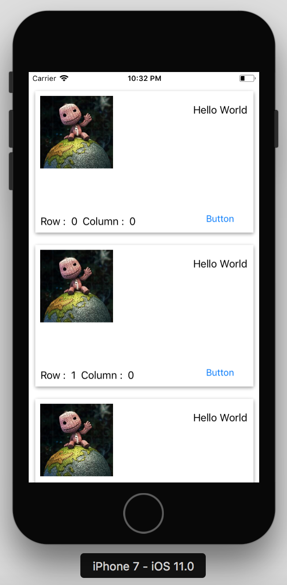
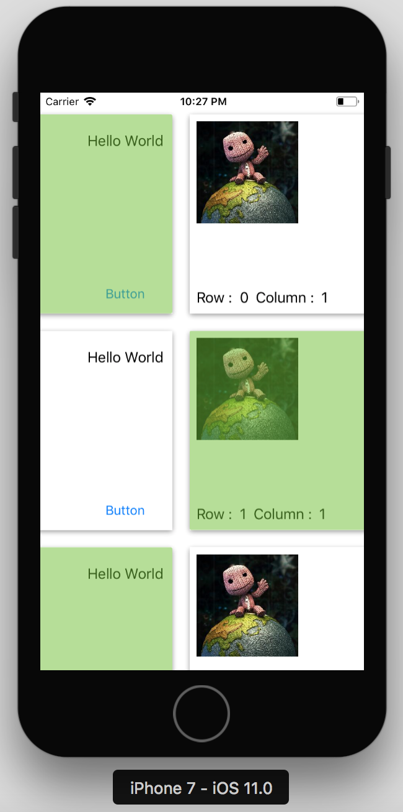

# ElanGridView

[](http://cocoapods.org/pods/ElanGridView)
[](http://cocoapods.org/pods/ElanGridView)
[](http://cocoapods.org/pods/ElanGridView)


## ScreenShot




## Example

To run the example project, clone the repo, and run `pod install` from the Example directory first.

or use `pod try ElanGridView`

## Sample Code

```swift
import UIKit
import ElanGridView

class ViewController: UIViewController, ElanGridViewDelegate {

    override func viewDidLoad() {
        super.viewDidLoad()
        let elanGridview: ElanGridView = ElanGridView(frame: self.view.frame)
        elanGridview.cellHeight = 250.0 // cards will match the parent height if cellHeight is not set or set to 0.0
        elanGridView.cellWidth = 250.0 // cards will match the parent width if cellWidth is not set or set to 0.0
        elanGridview.paddingTop = 20.0 // default value 10.0
        elanGridview.paddingLeft = 20.0 // default value 10.0
        elanGridview.paddingRight = 20.0 // default value 10.0
        elanGridview.paddingBottom = 20.0 // default value 10.0
        elanGridview.maxColumns = 10 // default value 1
        elanGridview.allowsMultipleSelection = true // default value false
        elanGridview.selectedColor = .red // default value UIColor(rgb: 0x0095ff)

        self.view.addSubview(elanGridview)

        elanGridview.elanGridViewDelegate = self
        for i in (0..<40){
            elanGridview.addCell(){
                cellView in
                let testView: UILabel = UILabel(CGRect(x: 10, y: 10, width: 200, height: 100))
                cellView.indexPath.tag = "hello \(i)"
                testView.text = "\(cellView.indexPath.row) \(cellView.indexPath.column)"

                cellView.addSubview(testView)
            }
        }


    }

    func onTapCard(_ elanCard: ElanCard) {

    }

    func onLongPressCard(_ elanCard: ElanCard) {

    }

    func selectedCards(_ selectedCards: [ElanIndex]) {

    }


}

```

## Installation

ElanGridView is available through [CocoaPods](http://cocoapods.org). To install
it, simply add the following line to your Podfile:

```ruby
pod 'ElanGridView'
```

## License

ElanGridView is available under the MIT license. See the LICENSE file for more info.
